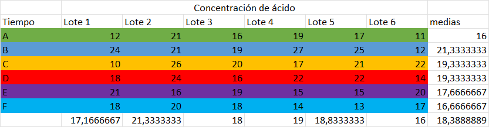

<div align="center">

# Taller ANOVA


</div>

### _Solución 1.a_

Tomando los datos preliminares

$\alpha = 5\%$

$\alpha = 0.05$

Con la tabla se pueden calcular las medias

$\bar{X}_{p15} = \frac{7+7+15+11+9}{5}$

$\bar{X}_{p15} = 9.8$

$\bar{X}_{p20} = \frac{12+17+12+18+18}{5}$

$\bar{X}_{p20} = 15.4$

$\bar{X}_{p25} = \frac{14+18+18+19+19}{5}$

$\bar{X}_{p25} = 17.6$

$\bar{X}_{p30} = \frac{19+25+22+19+23}{5}$

$\bar{X}_{p30} = 21.6$

$\bar{X}_{p35} = \frac{7+10+11+15+11}{5}$

$\bar{X}_{p35} = 10.8$

Usando los valores anteriores, se puede calcular el promedio de medias $\bar{\bar{X}}$

$\bar{\bar{X}} = \frac{9.8+15.4+17.6+21.6+10.8}{5}$

$\bar{\bar{X}} = 15.04$

Con las medias se puede calcular el $sctr$

$$sctr = \sum_{j=1}^k(n_j) * (\bar{x}_j - \bar{\bar{x}})^2$$

> Ya que en todos los casos se tomaron 5 muestras, se saca el 5 como factor común

$sctr = 5*[(9.8 - 15.04)^2 + (15.4 - 15.04)^2 + (17.6 - 15.04)^2 + (21.6 - 15.04)^2 + (10.8 - 15.04)^2]$

$sctr = 475.76$

Usando el $sctr$ se puede calcular el $cmtr$

$$cmtr = \frac{sctr}{k-1}$$

> Siendo $k$ el número de tratamientos, es decir; $k=5$

$cmtr = \frac{475.76}{5 - 1}$

$cmtr = 118.94$

Tambien se puede calcular el $sce$

$$sce = \sum_{j=1}^k(n_j-1)*S_j^2$$

Para poder calcularlo se necesita conocer la varianza de las muestras de cada proporción de algodón en las telas

<div align="center">

| Porcentaje de algodón | 15%  | 20%  | 25%  | 30%  | 35%  |
| --------------------- | ---- | ---- | ---- | ---- | ---- |
| Media                 | 9.8  | 15.4 | 17.6 | 21.6 | 10.8 |
| Varianza              | 8.96 | 7.84 | 3.44 | 5.44 | 6.56 |

</div>
  
> Para el calculo de la varianza se ha usado la función `VAR.P(valor)` de excel

Una vez con la tabla se puede hacer el calculo

> Ya que en todos los casos se tomaron $n_j$ muestras, se saca el $n_j - 1$ como factor común; como $n_j = 5$; entonces $n_j - 1 = 4$

$sce = 4 * [8.96 + 7.84 + 3.44 + 5.44 + 6.56]$

$sce = 128.96$

Una vez se calcula el $sce$ se puede calcular el $cme$, donde $n_T=25$ y $k=5$

$$cme = \frac{sce}{n_T-k}$$

$cme = \frac{128.96}{25 - 5}$

$cme = 6.448$

Una vez calculados los datos preliminares, se puede analizar la hipotesis

1. Plantenado las hipotesis:

$H_0: \mu_{15} = \mu_{20} = \mu_{25} = \mu_{30} = \mu_{35}$

$H_1: \mu_{15} \neq \mu_{20} \neq \mu_{25} \neq \mu_{30} \neq \mu_{35}$

2. Planteamos el alpa:

$\alpha = 0.05$

3. Se calcula el valor del estadistico de prueba $F$

$$F = \frac{cmtr}{cme}$$

Ya que $cmtr = 118.94$ y $cme = 6.448$

$F_{calculado} = \frac{118.94}{6.448}$

$F_{calculado} = 18.44602978$

Para calcular el valor de $F_{critico}$ se puede usar excel

```
INV.F.CD(alpha; k - 1; n_T - k)
```

Donde:

- $alpha = 0.05$
- $n_T = 25$
- $k = 5$

Por tanto:

```
INV.F.CD(0.05; 4; 25 - 5)
```

$F_{critico} = 2.866081402$

Se plantea la afirmación

$F_{calculado} > F_{critico}$

#### <i><ins>Respuesta:</ins></i>

$\therefore 18.44602978 > 2.866081402$ por lo que se rechaza la hipotesis $H_0$; es decir; el porcentaje de algodón en la tela si es un dato significitivo para lo que busca el ingeniero

<!---
Ref http://red.unal.edu.co/cursos/ciencias/2000352/html/casos/cont_03.html
-->

### _Solución 1.b_: Intervalo de confianza

Para calculas los intervalos se puede usar la formula

$$\mu = \bar{x}_i \pm t_{\frac{\alpha}{2}} * \frac{S}{\sqrt{n_j}}$$

Pero para hacer uso de esta se ha de calcular $S$, para este proposito se usa:

> Recordar que $cme = 6.448$

$$S = \sqrt{cme}$$

$S = \sqrt{6.448}$

$S = 2.53929124$

Otro dato útil será el valor crítico de la distribución $t$ de Student; para esto se determina que:

- Los grados de libertad entre grupos: $glg = k - 1 \rightarrow glg = 4$

- Los grados de libertad dentro de grupos: $gld = n_T - k \rightarrow gld = 20$

- Los grados de libertad totales: $glt = n_T - 1 \rightarrow glt = 24$

Con estos datos se puede determinar el valor de $t$ para las muestras y para la media de muestras; para ello se puede usar

```
DISTR.T.INV(2 * alpha; valor)
```

Para las muestras sería:

```
DISTR.T.INV(2 * 0.05; 5 - 1)
```

$t_{muestral} = 2.131846786$

$t_{media} = 1.71088208$

Por lo que simplificando un poco:

$\mu = \bar{x}_i \pm 2.131846786 * \frac{2.53929124}{\sqrt{5}}$

#### Intervalos

Intervalo para $15\%$ de algodón en la tela se puede calcula como:

$\mu = 9.8 \pm 2.420937075$

$\mu_1 = 9.8 + 2.420937075$

$\mu_1 = 12.22093707$

$\mu_2 = 9.8 - 2.420937075$

$\mu_2 = 7.379062925$

---

Intervalo para $20\%$ de algodón en la tela se puede calcula como:

$\mu = 15.4 \pm 2.420937075$

$\mu_1 = 15.4 + 2.420937075$

$\mu_1 = 17.82093707$

$\mu_2 = 15.4 - 2.420937075$

$\mu_2 = 12.97906293$

---

Intervalo para $25\%$ de algodón en la tela se puede calcula como:

$\mu = 17.6 \pm 2.420937075$

$\mu_1 = 17.6 + 2.420937075$

$\mu_1 = 20.02093707$

$\mu_2 = 17.6 - 2.420937075$

$\mu_2 = 15.17906293$

---

Intervalo para $30\%$ de algodón en la tela se puede calcula como:

$\mu = 21.6 \pm 2.420937075$

$\mu_1 = 21.6 + 2.420937075$

$\mu_1 = 24.02093707$

$\mu_2 = 21.6 - 2.420937075$

$\mu_2 = 19.17906293$

---

Intervalo para $35\%$ de algodón en la tela se puede calcula como:

$\mu = 10.8 \pm 2.420937075$

$\mu_1 = 10.8 + 2.420937075$

$\mu_1 = 13.22093707$

$\mu_2 = 10.8 - 2.420937075$

$\mu_2 = 8.379062925$

---

#### Tabla de intervalos

<div align="center">

|         | 15%         | 20%         | 25%         | 30%         | 35%         |
| ------- | ----------- | ----------- | ----------- | ----------- | ----------- |
| Punto B | 12.22093707 | 17.82093707 | 20.02093707 | 24.02093707 | 13.22093707 |
| Punto A | 7.379062925 | 12.97906293 | 15.17906293 | 19.17906293 | 8.379062925 |


</div>

<div align="center">


</div>

### _Tabla ANOVA_

Datos preliminares:

- $k = 3$
- $n_T = 30$
- $\alpha = 0.05$

| Fuente       | suma de cuadrados | Grados de libertad | Cuadrados medios | Estadistico F | F crititco    | Valor P       |
| ------------ | ----------------- | ------------------ | ---------------- | ------------- | ------------- | ------------- |
| Tratamientos | $4560$            | $2$                | $2280$           | $9.865384615$ | $3.354130829$ | $0.000539043$ |
| Error        | $6240$            | $27$               | $231.1111111$    |               |               |               |
| Total        | $10800$           | $29$               |                  |               |               |               |

### _Solución 2.a_

$\therefore 9.865384615$ > $3.354130829$ se rechaza la hipotesis $H_0$, lo que indica que hay una diferencia significativa entre los métodos propuestos

<div align="center">


</div>

### _Solución 3.a_

<!--
Ref: https://es.slideshare.net/iorifoar/ejercicios-cuadrados-greco-latinos-ejercicio-3
-->

El primer paso será re ordenar los datos

<div align="center">


</div>

Tomando los datos preliminares

$A = 6$

$B = 6$

$n = 36$

Una vez se tiene los datos preliminares y la tabla ordenada podemos calcular la media de los datos

<div align="center">



</div>

Con la media de los datos podemos facilmente calcular los cuadrados de cada factor

Para el factor A que corresponde con el tiempo de los quimicos podemos usar:

$$SC_A = b * \sum_{i=1}^{a}{\bar{y_i}^2 - n * \bar{y}^2}$$

Donde:

- $b = 6$
- $n = 36$
- $\bar{y} = 18.38888889$

$SC_A = 6 * (16^2 + 21.33333333^2 + 19.33333333^2 + 19.33333333^2 + 17.66666667^2 + 16.66666667^2) - 36 * 18.38888889^2$

$SC_A = 117.8888889$

Para el factor B similar al factor A podemos usar:

$$SC_B = a * \sum_{i=1}^{b}{\bar{y_i}^2 - n *\bar{y}^2}$$

Donde:

- $b = 6$
- $n = 36$
- $\bar{y} = 18.38888889$

$SC_B = 6 * (17.16666667^2 + 21.33333333^2 + 18^2 + 19^2 + 18.83333333^2 + 16^2) - 36 * 18.38888889^2$

$SC_B = 99.55555556$

Otro dato que se puede calcular es el total o SCT, para esto usamos:

$$SCT = \sum_{i=1}^{a} \sum_{i=1}^{b}{\bar{y_{ij}}^2 - n *\bar{y}^2}$$

Donde:

- $\sum_{i=1}^{a} \sum_{i=1}^{b}{\bar{y_{ij}}^2} = 12808$
- $n = 36$
- $\bar{y} = 18.38888889$

$SCT = 12808 - 36 * 18.38888889^2$

$SCT = 634.5555556$

Con estos valores se puede calcular el SCE:

$$SCE = SCT - (SC_{A} + SC_{B})$$

Donde:

- $SC_A = 117.8888889$
- $SC_B = 99.55555556$
- $SCT = 634.5555556$

$SCE = 634.5555556 - (117.8888889 + 99.55555556)$

$SCE = 417.1111111$

1. Plantenado las hipotesis:

$H_0: \alpha_{i} = 0$

$H_1: \alpha_{i} \neq 0$

> La hipotesis se ha de centrar en el factor A (El tiempo), no tendría sentido centrarse en los lotes

2. Planteamos el alpa:

$\alpha = 0.05$

3. Se calcula el valor del estadistico de prueba $F$

Para este proposito se puede usar la tabla de ANOVA; ya que se han calculado los datos previamente se puede facilmente reemplazar en la tabla ANOVA

<div align="center">

| Fuente   | Suma de cuadrados | Grados de libertad       | Cuadrados medios                      | Estadistico F                     | F critico  | Valor P   |
| -------- | ----------------- | ------------------------ | ------------------------------------- | --------------------------------- | ---------- | --------- |
| Factor A | $SC_A$            | $GL_A = a - 1$           | $MC_A = \frac{SC_A}{a - 1}$           | $F_{objetivo} = \frac{MC_A}{MCE}$ | `INV.F.CD` | `DISTR.F` |
| Factor B | $SC_B$            | $GL_B = b - 1$           | $MC_B = \frac{SC_B}{b - 1}$           |                                   |            |           |
| Error    | $SCE$             | $GLE = (a - 1) * (b -1)$ | $MC_E = \frac{SCE}{(a - 1) * (b -1)}$ |                                   |            |           |
| Total    | $SCT$             | $GLT = ab - 1$           |                                       |                                   |            |           |

</div>

> Notese que los valores a usar en las funciones de excel `INV.F.CD` y `DISTR.F` serían respectivamente

```
=INV.F.CD(alpha; GL_A; GLT)
=DISTR.F(Estadistico_F; GL_A; GLT)
```

Reemplazando los datos tenemos

<div align="center">

| Fuente   | Suma de cuadrados | Grados de libertad | Cuadrados medios | Estadistico F | F critico   | Valor P     |
| -------- | ----------------- | ------------------ | ---------------- | ------------- | ----------- | ----------- |
| Factor A | 117.8888889       | 5                  | 23.57777778      | 1.413159297   | 2.485143221 | 0.243662729 |
| Factor B | 99.55555556       | 5                  | 19.91111111      |               |             |             |
| Error    | 417.1111111       | 25                 | 16.68444444      |               |             |             |
| Total    | 634.5555556       | 35                 |                  |               |             |             |

</div>

Por tanto se puede afirmar que:

- $F_{objetivo} = 1.413159297$
- $F_{critico} = 2.485143221$

4. Se plantea la afirmación

$F_{objetivo} > F_{critico}$

$1.413159297 > 2.485143221$

#### <i><ins>Respuesta:</ins></i>

$\therefore 1.413159297 > 2.485143221$ por lo que se rechaza la hipotesis $H_1$; es decir; estadisticamente hablando con un seguridad del 95% se puede afirmar que no existe una diferencia signicativa entre los tiempos de respose A, B, C, D, E y F

<div align="center">


</div>

### _Solución_

Tomando los datos preliminares

$\alpha = 5\%$

$\alpha = 0.05$

$k = 4$

$n = 12$

1. Plantenado las hipotesis:

$H_0: \alpha_{i} = 0$

$H_1: \alpha_{i} \neq 0$

> La hipotesis se ha de centrar en el factor A (El detergente), no tendría sentido centrarse en las manchas

2. Planteamos el alpa:

$\alpha = 0.05$

3. Se calcula el valor del estadistico de prueba $F$

Para este proposito podemos usar la tabla ANOVA

<div align="center">

| Fuente   | Suma de cuadrados | Grados de libertad       | Cuadrados medios                      | Estadistico F                     | F critico  | Valor P   |
| -------- | ----------------- | ------------------------ | ------------------------------------- | --------------------------------- | ---------- | --------- |
| Factor A | $SC_A$            | $GL_A = a - 1$           | $MC_A = \frac{SC_A}{a - 1}$           | $F_{objetivo} = \frac{MC_A}{MCE}$ | `INV.F.CD` | `DISTR.F` |
| Factor B | $SC_B$            | $GL_B = b - 1$           | $MC_B = \frac{SC_B}{b - 1}$           |                                   |            |           |
| Error    | $SCE$             | $GLE = (a - 1) * (b -1)$ | $MC_E = \frac{SCE}{(a - 1) * (b -1)}$ |                                   |            |           |
| Total    | $SCT$             | $GLT = ab - 1$           |                                       |                                   |            |           |

</div>

Para poder llenar la tabla se han de calcular algunos datos empezando por la media de los datos

<div align="center">


</div>

Con la media de los datos podemos facilmente calcular los cuadrados de cada factor

Para el factor A que corresponde con el tiempo de los quimicos podemos usar:

$$SC_A = b * \sum_{i=1}^{a}{\bar{y_i}^2 - n * \bar{y}^2}$$

$SC_A = 3 * (46.33333333^2 + 48.33333333^2 + 51^ + 42.66666667^2) - 12 * 47.08333333^2$

$SC_A = 110.9166667$

Para el factor B similar al factor A podemos usar:

$$SC_B = a * \sum_{i=1}^{b}{\bar{y_i}^2 - n *\bar{y}^2}$$

$SC_B = 4 * (45.5^2 + 44^2 + 51.75^2) - 12 * 47.08333333^2$

$SC_B = 135.1666667$

Otro dato que se puede calcular es el total o SCT, para esto usamos:

$$SCT = \sum_{i=1}^{a} \sum_{i=1}^{b}{\bar{y_{ij}}^2 - n *\bar{y}^2}$$

$SCT = 26867 - 12 * 47.08333333^2$

$SCT = 264.9166667$

Con estos valores se puede calcular el SCE:

$$SCE = SCT - (SC_{A} + SC_{B})$$

$SCE = 264.9166667 - (110.9166667 + 135.1666667)$

$SCE = 18.83333333$


<div align="center">

#### Tabla ANOVA

| Fuente   | Suma de cuadrados | Grados de libertad | Cuadrados medios | Estadistico F | F critico   | Valor P     |
| -------- | ----------------- | ------------------ | ---------------- | ------------- | ----------- | ----------- |
| Factor A | 110.9166667       | 3                  | 36.97222222      | 11.77876106   | 0.984430722 | 0.000926591 |
| Factor B | 135.1666667       | 2                  | 67.58333333      |               |             |             |
| Error    | 18.83333333       | 6                  | 3.138888889      |               |             |             |
| Total    | 264.9166667       | 11                 |                  |               |             |             |

</div>

4. Se plantea la afirmación

$F_{calculado} > F_{critico}$

$11.77876106 > 0.984430722$

#### <i><ins>Respuesta:</ins></i>

$\therefore 11.77876106 > 0.984430722$ por lo que se rechaza la hipotesis $H_0$; es decir; estadisticamente hablando con un seguridad del 95% se puede afirmar que entre los 4 detergentes hay una diferencia
