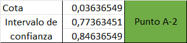
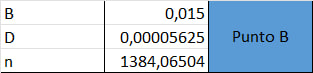
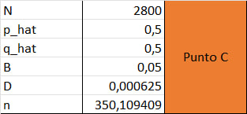
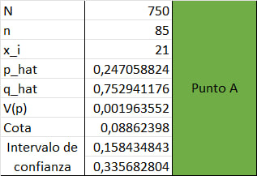
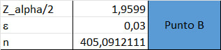
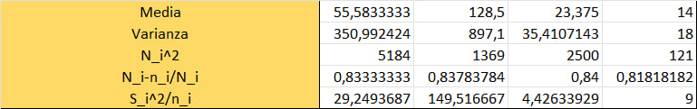

# Taller 3: Tipos de muestreo

1. En una zona se desea estimar la producción total de papa un productor que cuenta con tres parcelas. las cuales están divididas en tres ranchos con diferentes condiciones climáticas, por lo que se plantea un muestreo estratificado. Del primer rancho se muestrearon 10 plantas de 900, en el segundo rancho 12 plantas de 1100 y en el tercero 12 de 1050. Con los datos que se muestran a continuación calcular.

a) El total de la producción del consumidor, límite para el error y el intervalo de confianza.

b) Si se quiere error máximo de 350 kilos. ¿Cual debe ser el tamaño de muestra adecuado?, para que los pesos ($w_i$) son totales con respecto al total de plantas

## Solución

Obtenemos los datos preliminares:

### Ejercicio 1-A

Una vez tenemos los datos preliminares, se puede calcular algunos datos necesarios para el punto A, para ello podemos determinar las formulas que se han de usar:

$$\tau = N * \bar{Y}_{st} = \sum_{i=1}^{L}{N_{i} * \bar{y}_i}$$

$$
\hat{V}(\bar{Y}_{st}) = N^2\hat{V}(\bar{Y}_{st}) = \sum_{i=1}^{L}{N_i^2 * (\frac{N_i - n_i}{N_i}) * (\frac{S_i^2}{n_i})}
$$

$$
2 * \sqrt{\hat{V} (N \bar{Y}_{st})} = 2 * \sqrt{\sum_{i=1}^{L}{N_{i}^{2} * (\frac{N_i - n_i}{N_i}) * (\frac{S_i^2}{n_i})}}
$$

$$E = \sqrt(V(\tau)) * 2$$

Podemos usar los datos anteriores y las formulas para facilmente calcular los resultado con excel

Ahora bien, con los estos datos podemos determinar el total de la producción del consumidor ($\tau$), límite para el error ($\epsilon$) y el intervalo de confianza

### Ejercicio 1-B

Ahora para poder calcular el tamaño de muestra adecuado se pueden usar los datos anteriores y la formula:

$$
n = \frac{\sum_{i=1}^{L}{N_i^2 * \frac{\sigma_i^2}{w_i}}}{N^2 * D + \sum_{i=1}^{L}{N_i * \sigma_i^2}}
$$

Recordar que el valor de D será:

$$
D = \frac{B^2}{4 * N^2}
$$

Con ello se puede calcular el tamaño de muestra adecuado para esto será necesario determinar las sumatorias:

$$
\sum_{i=1}^{L}{N_i^2*(\frac{\sigma_i^2}{w_i})}
$$

> Cuyo valor será: $2017575$

$$
\sum_{i=1}^{L}{N_i*\sigma_i^2}
$$

> Cuyo valor será: $661.5$

Por tanto, se puede afirmar estadisticamente hablando que se requiere de 64.487 plantas (Aproximado a 65 plantas), esto para que el error maximo sea de 350 kilos

---

2. La policía de carreteras está interesada en la proporción de automovilistas que portan su licencia. Se instala un puesto de verificación en una carretera principal, y se detiene un vehículo cada siete. Use los datos de la tabla de la derecha para estimar la proporción de conductores que portan su licencia.

a) Establezca un límite para el error de estimación y presente el correspondiente intervalo de confianza. Suponga que N = 2800 autos pasan por el puesto de verificación durante el período de muestreo.

b) Calcular n si se tiene un error del 0,015 con el p estimado

c) Calcular n maximizando el tamaño de muestra

## Solución

### Ejercicio 2 - A

Necesitamos calcular algunos datos preliminares con ayuda de las formulas:

$$
\hat{p} = \frac{\sum{Y_i}}{n}
$$

$$
\hat{q} = 1 - \hat{p}
$$

$$
\hat{V}(\bar{p}) = \frac{\hat{p} * \hat{q}}{n-1} * \frac{N - n}{N}
$$

Una vez se tengan estos datos se podrá calcular el intervalo de confianza y el limite para el error

Ya para determinar el limite para el error podemos usar la formula:

$$
2 * \sqrt{\hat{V}(\bar{p})}
$$

Para el intervalo se puede usar:

$$
int_{1,2} = \hat{p} \pm \epsilon
$$

Ejercicio 2 - B

Para el calculo de $n$ con los datos que nos proporciona el ejercicio podemos usar la formula:

$$
n = \frac{N * \hat{p} * \hat{q}}{(N - 1) * D + \hat{p} * \hat{q}}
$$

Para este caso de uso, se puede determinar $D$ usando:

$$
D = \frac{B^2}{4}
$$

$\therefore$ Estadisticamente hablando se puede decir que el tamaño de muestra necesario será de $n = 1384$

Ejercicio 2 - C

> Recordar el punto maximo está representado por $\hat{p} = 0.5$ y $\hat{q} = 0.5$

Para este caso podemos usar las formulas anteriores:

$$
n = \frac{N * \hat{p} * \hat{q}}{(N - 1) * D + \hat{p} * \hat{q}}
$$

Para este caso de uso, se puede determinar $D$ usando:

$$
D = \frac{B^2}{4}
$$

$\therefore$ Estadisticamente hablando podemos decir que el tamaño de muestra maximizado será de $n = 350$

---

3. En un estudio sociológico realizado en una pequeña ciudad, se hicieron llamadas telefónicas para estimar la proporción de hogares donde habita cuando menos una persona mayor de 65 años de edad. La ciudad tiene 750 hogares, se tomó una muestra aleatoria de 85 hogares y se obtuvo la información de que en 21 de ellos habita por lo menos un adulto mayor a 65 años

a) Estime la proporción de hogares donde habita por lo menos una persona mayor de 65 años de edad y establezca un límite para el error de estimación.

b) Partiendo del supuesto de que no se ha realizado estudios similares en esta ciudad y se desea realizar una estadística que maneje una cota de error de 3 puntos y un nivel de significancia de 5%, ¿De cuánto debe ser el tamaño de la muestra?

## Solución

### Ejercicio 3 - A

Una vez se identificando los datos preliminares se pueden usar algunas formulas para facilitar el calculos del limite de error y de la proporción de hogares habitados por mayores de 65 años:

$$
\hat{p} = \frac{\sum{Y_i}}{n}
$$

$$
\hat{q} = 1 - \hat{p}
$$

$$
\hat{V}(\bar{p}) = \frac{\hat{p} * \hat{q}}{n-1} * \frac{N - n}{N}
$$

### Ejercicio 3 - B

Para determinar el tamaño de esa población se puede usar la formula:

$$
\frac{Z_{\frac{\alpha}{2}} * \hat{p} * \hat{q}}{\epsilon^2}
$$

$\therefore$ Estadisticamente hablando el tamaño de muestra que cumple con esos constrains será de aproxidamente $n = 405$

---

4. Las granjas de una cierta región se dividen en cuatro categorías según su superficie. El número de granjas en cada categoría es 72, 37, 50 y 11. Un estudio para estimar el total de vacas productoras de leche en la región produce una muestra estratificada de 28 granjas. El total de vacas productoras de leche en estas 28 granjas viene dado en la siguiente tabla.

a) Estimar el total de vacas productoras de leche, así como el límite para el error de estimación

## Solución

Primero, se re ordena la tabla

Luego se pueden determinar algunos datos

Con los datos anteriores se puede usar excel para calcular algunos datos para poder reemeplazar en las formulas que nos permitirán determinar la solución al problema:

$$\tau = N * \bar{Y}_{st} = \sum_{i=1}^{L}{N_{i} * \bar{y}_i}$$

$$
\hat{V}(\bar{Y}_{st}) = N^2\hat{V}(\bar{Y}_{st}) = \sum_{i=1}^{L}{N_i^2 * (\frac{N_i - n_i}{N_i}) * (\frac{S_i^2}{n_i})}
$$

$$
2 * \sqrt{\hat{V} (N \bar{Y}_{st})} = 2 * \sqrt{\sum_{i=1}^{L}{N_{i}^{2} * (\frac{N_i - n_i}{N_i}) * (\frac{S_i^2}{n_i})}}
$$

$$E = \sqrt(V(\tau)) * 2$$

Con estos datos podemos determinar los datos necesarios para responder el punto a

